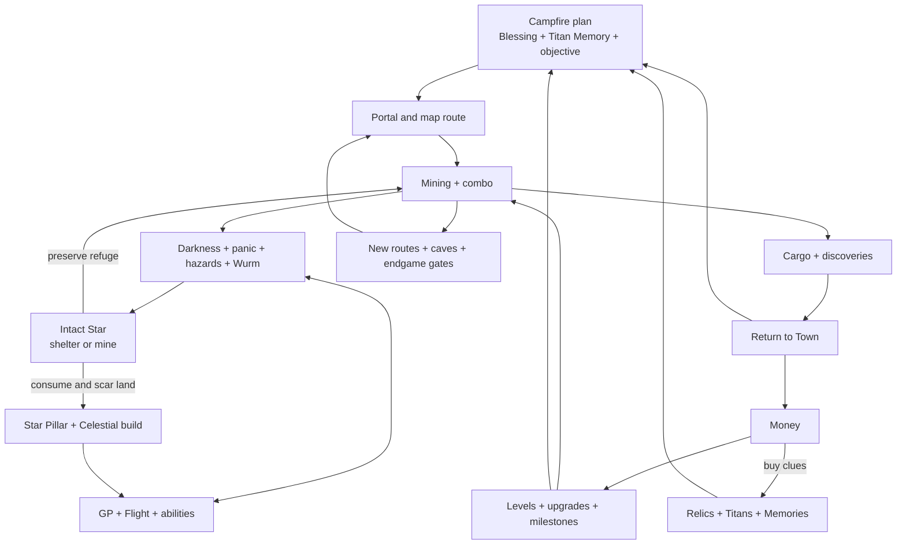

# Interconnected System Ecosystem

**Date:** 2026-08-30  
**Status:** ACTIVE V1 — Star Sanctuary / Starless Scar implementation  
**Scope:** Stars only. Focus, caves, Campfire bridges, Titans, portals, and
landmark work are explicitly deferred.  

## Purpose

UNDERSTAR already has many enjoyable systems: mining, cargo, Money, player
levels, upgrades, GP, Flight, abilities, combo, darkness, Hardcore panic,
Campfire blessings, Stars, the Star Pillar, Celestial talents, caves, portals,
Titans, relics, milestones, random events, weather, earthquakes, the
Graveborer Wurm, crafting, and the Journey.

The problem is not a lack of systems. The problem is that too many systems
begin and end inside their own screen. Their rewards are useful, but their
consequences are often invisible or one-way.

This proposal turns those systems into a readable ecosystem in which:

- danger changes what the player values;
- discoveries change the next expedition;
- permanent progression creates new decisions rather than only larger numbers;
- temporary run choices reshape how permanent systems are used;
- every important interaction explains its cause and result;
- no new general-purpose currency is introduced.

This proposal builds on, but does not replace, the canonical design set:

- [Game Vision](design-documents/2026-08-10-game-vision.md)
- [Gameplay Systems](design-documents/2026-08-10-gameplay-systems.md)
- [Progression, Economy, and Saves](design-documents/2026-08-10-progression-economy-and-saves.md)
- [World and Content](design-documents/2026-08-10-world-and-content.md)
- [Player Journey](design-documents/2026-08-10-player-journey.md)
- [Runtime Alignment Register](design-documents/2026-08-10-runtime-alignment-register.md)

## Executive decision

The first implementation is one narrow vertical slice:

> Every intact Star is a small, uniquely tuned underground base. It provides
> light, Panic relief, and limited GP charging. Mining it gives the normal Star
> reward, permanently destroys that exact base, and leaves a fixed Starless
> Scar where darkness Panic builds faster.

There is no danger bonus, bonus Sign XP, new currency, or extra reward for
destroying a Star. The value comes from what the player gives up.

This slice directly joins Star identity, light, darkness, Panic, GP, mining,
and permanent world state without adding another resource bar or save field.
Other system connections remain future material until this choice is proven.

## Design rules

### 1. Every system gets a small interlock budget

Each system should have, at most:

1. one meaningful input from another system;
2. one meaningful output to another system;
3. one player-facing decision created by that relationship;
4. one visible causal receipt.

This prevents an unreadable web in which every modifier affects everything.

### 2. Connections must change decisions

A valid connection changes at least one of these:

- what the player preserves or destroys;
- which route the player takes;
- when the player returns to Town;
- which temporary blessing, ability, upgrade, or Memory the player selects;
- how much risk the player accepts;
- what the player spends now versus saves for later.

An extra `+5%` that never changes a choice is not enough by itself.

### 3. Reuse existing resources and states

New mechanics may spend, reward, or transform existing concepts:

- carried resources;
- Money;
- XP and player levels;
- GP;
- Star Points and Sign XP;
- Ember Charges;
- combo;
- panic / Stress;
- discovery and route state.

Do not add Titan Essence, Campfire Dust, Panic Tokens, Portal Energy, or
another general-purpose currency.

### 4. A risk state is not a wallet

Panic, darkness exposure, Wurm noise, weather, and earthquake danger may
qualify or shape a reward. They must not become resources that players farm by
standing still or deliberately taking repeated damage.

### 5. Keep one authority per fact

- `HardcoreModeSystem` continues to own Stress and Hardcore risk.
- `LightSystem` continues to own torch state, reveal, and GP upkeep.
- `DigSystem` continues to own tile destruction and resource rewards.
- Star collection / Pillar progression continues to own Star rewards.
- `CampfireSystem` continues to own blessing state and Ember Charges.
- `UpgradeSystem` continues to own Money and purchased upgrades.
- `ComboSystem` continues to own combo.
- Titan discovery and clue systems continue to own their records.
- Map, Journey, HUD, audio, and visual systems explain state; they do not
  duplicate reward authority.

Cross-system behavior should use injected snapshots and bounded callbacks at
the PlayScene composition boundary, not direct circular imports.

## Current ecosystem audit

| System | Existing feeds | Existing outputs | Main missing link |
| --- | --- | --- | --- |
| Mining | damage, cooldown, crit, combo, depth, Campfire, Celestial effects | cargo, XP, Stars, special blocks, noise | rewards rarely alter the immediate route decision |
| Cargo and Money | mined resources, events, chests, selling | upgrades, Campfire tiers, Titan clues | purchases do not always show which expedition problem they solved |
| Levels and milestones | XP and reached depth | darkness resistance, GP, speed, crit, yield, Celestial gates | mostly passive improvement rather than new loadout choices |
| GP, Flight, torch, abilities | upgrades, milestones, regeneration | traversal, light, attacks, Hardcore death boundary | one pool supports many systems, but their opportunity costs are understated |
| Darkness and panic | depth, rapid descent, torch intensity, player level | Stress, high-Stress GP drain, death pressure | strong current interaction, but few environmental choices respond to it |
| Stars and Star Pillar | world spawn, mining, rarity, identity, Sign progress, existing intact-Star Stress recovery | normal Sign XP / Star rewards, local light, GP refuge | V1 now makes every intact Star a named mini-base and every mined Star a permanent scar |
| Campfire | Money tiers, Ember Ore, Town return | one selected timed blessing | three good choices mostly modify mining in isolation |
| Titans and relics | exploration, Money-backed clues, tile clearing | permanent discoveries, lore, crafting requirements | collection has little effect on the next run before endgame crafting |
| Caves and hazards | depth, cave identity, Flight, GP | resource seams, chests, route challenges, checkpoint recovery | navigation can interrupt combo and mining rather than feed them |
| Portals and map | discovery and activation | reusable return routes and navigation | route knowledge is useful but rarely participates in build planning |
| Weather and earthquakes | world time, shelter, depth, upgrades | surface movement / visibility pressure, opened passages, nearby tile rewards | consequences are real but not presented as preparation choices |
| Wurm | Hardcore, depth, mining noise | pursuit, GP loss, memorial story | ability and mining-style tradeoffs are not explicit enough |
| Random events and chests | exploration, recent resources, depth | Money, resources, Stars, crit buff, risk transactions | already good connectors, but receipts are not unified with the run plan |
| Crafting and endgame | resources, relic thresholds, discoveries, upgrades | Heavenblocks and Arc Core ownership | correctly convergent, but future content must remix existing loops |
| Journey and retention | permanent events and live progress | goals, history, next promise, summaries | should explain causal chains rather than become another reward system |

Treasure chests are a useful existing reference: one exploration object can
produce Money, an occasional Star, and a temporary critical-hit buff. The
lesson is not to make every reward contain three prizes; it is to make each
discovery feed the expedition, the permanent build, or both.

## Target ecosystem map

The intended rhythm is:

1. **Plan:** choose one temporary run identity.
2. **Route:** choose a destination and return threshold.
3. **Pressure:** mine while light, GP, cargo, combo, and hazards compete.
4. **Decision:** preserve a reusable mini-base or take its normal reward now.
5. **Return:** turn the haul and discoveries into permanent options.
6. **Rebuild:** choose a different response to the next expedition.

## Resource and progression roles

| Concept | Stable role | It should feed | It should not become |
| --- | --- | --- | --- |
| Cargo | value carried at risk until sold or used | Money, crafting, event stakes | a second permanent wallet |
| Money | broad preparation and infrastructure | upgrades, Campfire tiers, Titan clues | direct Celestial specialization |
| XP / levels | complexity gates and baseline resilience | darkness reach, feature slots, level-gated systems | a second shop currency |
| GP | active energy and danger buffer | Flight, torch, abilities, Hardcore survival | a permanent collectible |
| Star Points | Celestial specialization | talents and Engine build choices | generic shop money |
| Sign XP | identity mastery inside Star progression | Sign levels and unlock pacing | an expedition consumable |
| Ember Charges | limited use of an existing temporary blessing | Campfire expedition plan | an endlessly farmable global currency |
| Titan discovery | qualitative rule modifier | Memories equipped at Campfire | stackable passive percentage soup |
| Ancient Relics | permanent requirements | Heavenblocks and forge convergence | consumed crafting material |
| Combo | moment-to-moment mining momentum | GP checkpoints, cave momentum, damage cadence | permanent progression |
| Panic / Stress | a readable risk state | route and timing decisions | a spendable or grindable currency |
| Portal state | learned route infrastructure | objectives, returns, map planning | a passive damage bonus |

## Interaction family A — light, greed, and Stars

### A1. Every intact Star is a mini-base

The existing foundation remains authoritative: intact Stars emit colored
light, and Hardcore already uses close Star proximity for Stress recovery.

V1 adds one universal service: stand nearly still beside an intact Star for a
short warm-up and it generates extra GP up to that refuge's safe reserve. It
never drains GP above the reserve and it does not provide combat immunity.

An intact Star therefore provides three simple reasons to return:

- permanent local light;
- Panic relief in Hardcore;
- limited GP charging in both Casual and Hardcore.

### A2. Every Star has its own refuge profile

The game already has 250 authored Star identities. V1 uses the identity,
rarity, and fixed world coordinate to resolve one deterministic profile:

- **Wellspring:** charges GP faster;
- **Reservoir:** charges GP to a higher reserve;
- **Haven:** has a wider safe radius and stronger Panic recovery.

Rarity improves the base GP rate and reserve. Small deterministic differences
in rate, reserve, radius, and recovery make two Star sites distinct without
adding 250 hand-authored perk tables or new saved data.

Entering the radius names the Star and temperament. Resting shows its exact GP
rate and cap, so the difference is visible rather than hidden in a formula.

### A3. Preserve or consume

- **Preserve:** keep this unique, reusable mini-base forever.
- **Consume:** receive the normal Star reward and permanently destroy this
  mini-base. No bonus Sign XP, Star Points, or danger reward is granted.

The first attempted Star sacrifice in a save slot has no countdown. Gameplay
stops behind the approved warning panel and explains the complete permanent
loss: light, GP recovery, Panic relief, and the four-tile Starless Scar where
darkness Panic builds 60% faster. The player must type exact `DESTROY` and
press Enter. Escape closes the panel and leaves the Star untouched.

Typing `DESTROY` acknowledges the rule only. It never damages or authorizes
the current Star, and the player must deliberately begin mining again.

Every Star then uses a fresh one-second continuous mining hold before damage
is authorized. Releasing mine or changing target resets the hold. During that
second, the world shows the exact four-tile scar footprint and an approved
framed percentage meter states which services will be lost:

> REMOVING THIS STAR WILL CONSUME THE SURROUNDING LAND • HOLD MINE

Once confirmed, the normal `DigSystem` destruction and Star reward path remains
the sole reward authority.

### A4. The permanent Starless Scar

Destroying the Star leaves a fixed four-tile-radius scar that never spreads:

- the land is visibly blackened with a dead core and branching rot;
- the former light, GP service, and Panic relief are gone;
- darkness-driven Panic builds 60% faster inside the scar in Hardcore;
- Casual still loses the light, GP service, landmark, and healthy ground;
- a nearby intact Star can still provide its own refuge normally.

The scar coordinate, rarity, and identity are derived from the existing saved
dug-tile source record. No save schema or second permanent scar list is needed.
The world map can render these same coordinates later; map work is deferred.

### A5. Causal receipt

Use short status receipts, never a new menu:

> MOLTEN CRIMSON • WELLSPRING REFUGE • REST FOR GP  
> MOLTEN CRIMSON • +12.1 GP/s TO 77%  
> STARLESS SCAR • DARKNESS PANIC +60%

## Interaction family B — Campfire as expedition loadout

The Campfire already has Ember Charges, ten Money-funded tiers, and three
blessings. The correct expansion is to deepen those three choices.

### Warmth — safety through momentum

Existing: mining-speed bonus.

TARGET bridge effects:

- reduced darkness-driven Stress gain while the blessing is active;
- stronger recovery inside a Star Sanctuary;
- brief protection from surface wetness after leaving Town, if weather
  gameplay remains enabled.

Player identity: **push farther with less interruption**.

### Inspiration — progression through recovery

Existing: XP bonus.

TARGET bridge effects:

- a small, capped GP refill when a real player level is gained;
- the next meaningful level or milestone unlock is favored by Next Promise;
- no refill for debug grants, repeated load, or already-recorded levels.

Player identity: **convert the expedition into permanent growth**.

### Focus — deferred for complete redesign

The current critical-hit bonus is not a coherent build identity. Do not attach
GP refunds, Panic rewards, or cave rules to it. Focus and critical progression
need a separate ground-up proposal before any implementation.

### Campfire constraints

- One blessing remains active at a time.
- One Ember Charge starts the blessing exactly as today.
- Tier upgrades improve the existing duration and stat values; bridge effects
  scale only if measurement proves the base effect remains legible.
- The Campfire is not a second talent tree.
- The selection screen previews the two systems affected by each blessing.

## Interaction family C — Titans become Memories

Titan clues already turn Money into a directed expedition, and discoveries are
permanent. Add one new consequence: a discovered Titan may unlock one
**Titan Memory** that can be equipped at the Campfire.

A Memory changes one rule. It does not add a new active skill, wallet, or
collection tier.

### Initial Level One prototypes

| Titan | Memory concept | Systems joined | Decision created |
| --- | --- | --- | --- |
| Lantern Jaw | **Cold Lantern:** Star Sanctuary reaches slightly farther but charges GP more slowly | Titans + Stars + darkness | choose between a wider shelter and a faster charger |
| Crowned Mole | **Buried Regent:** a clean cave-hazard crossing briefly reveals the nearest real resource seam | Titans + caves + map + mining | take the hazardous route for knowledge, not a free drop |
| Ember Tusk | **Furnace Herald:** Warmth also softens Ember Vent recovery loss, but no longer improves Star Sanctuary recovery | Titans + Campfire + cave hazards | specialize in heat routes instead of general darkness safety |

These are prototypes, not final balance. Ship at most these three before
creating Memories for the remaining Titans.

### Later Memories

- **Needlecrown:** makes earthquake warning direction and epicenter clearer;
  it does not suppress the quake.
- **Worldroot Titan:** rewards broad collection mastery with a loadout rule,
  not a permanent all-stats multiplier.

### Memory slot rules

- Start with one equipped Memory slot.
- A second slot may be a later level / milestone unlock only after one-slot
  choice diversity is healthy.
- Duplicate discoveries do not stack.
- Equip changes occur at the Campfire or another explicit safe boundary.
- Casual mode has access to Memories; Hardcore-specific clauses become inert
  or receive an equivalent non-Hardcore description.

## Interaction family D — Celestial branches answer different pressure

Celestial powers should not only mine more blocks. Each branch needs one
bridge that changes how the player handles an expedition.

### Wayward Star — route and light

- Rebounding Stars briefly illuminate the path they actually travel.
- A Star that crosses a discovered but unmined Star Sanctuary can extend that
  sanctuary for the current activation only.
- The map may display the last activation path only as temporary navigation;
  it does not create permanent discovery through unseen walls.

Identity: **mobile route control**.

### Hollow Sun — space and hazard timing

- Gravity pulses may hold loose earthquake rubble / cave debris presentation
  clear for their real active window, without changing protected collision.
- A cleanly timed activation can preserve combo across a cave obstruction.
- It must not erase cave hazards or grant rewards for tiles it did not
  authoritatively destroy.

Identity: **control the room and preserve momentum**.

### Stellar Lance — decisive pressure break

TARGET bridge, subject to explicit approval because current Stellar Lance is
intentionally separated from Stress:

- activation clears current Stress through `HardcoreModeSystem.clearStress()`;
- its active window may pass the existing `stressSuppressed` input, while
  hazards and Wurm damage remain dangerous;
- Mining through multiple blocks still resolves normal tile rewards and Wurm
  noise through `DigSystem`.

Identity: **spend heavily to turn a dangerous moment into an aggressive push**.

### Required decision before implementation

Current runtime behavior and older documentation / copy disagree about the
activation budget and terminology:

- some canonical copy describes a shared Star Heart / Celestial Charge bank;
- the current Celestial system contract and action bar spend GP;
- talent copy contains both “Celestial Charge” and “GP” wording;
- Stellar Lance still has legacy internal “rage” identifiers.

Approve one player-facing contract before adding new rewards. Do not let Star
collection refill a dormant legacy bank while the action bar spends GP.

Recommended direction: keep **GP as the live activation cost**, keep Star
Points as permanent specialization, migrate old charge saves only for
compatibility, and remove player-facing charge promises after approval.

## Interaction family E — caves, hazards, combo, and abilities

### Clean-cross momentum

Caves already pair real resource seams with GP-emptying hazards and safe
checkpoints. Their success state should feed mining:

- entering a hazard span snapshots the current combo;
- crossing without contact grants a short combo-decay grace window;
- reaching the authored seam resumes normal combo rules;
- leaving, teleporting, reloading, or failing removes the grace;
- failure keeps the existing all-GP loss and safe checkpoint recovery, with no
  extra punishment.

This makes traversal part of the mining rhythm instead of a forced pause.

### Ability opportunity cost

- Flight is the reliable hazard answer but spends the same GP used by light
  and attacks.
- Quick Slash and Thunderstrike accelerate mining but should publish their
  Wurm noise contribution.
- Celestial multi-tile destruction must feed combo, rewards, resource history,
  objectives, and Wurm noise through the same authoritative tile results.
- Focus contributes nothing here until its complete redesign is approved.

### Cave identity matters mechanically

Keep one readable difference per cave family:

- Echo / Storm: timing and pulse-reading;
- Root / Gilded: heavier darkness and route commitment;
- Prism: clearer visibility but stronger resource temptation;
- Ember: heat timing and Ember Ore / Campfire relevance.

Do not give every cave six unique modifiers. The existing darkness profile,
seam bias, hazard profile, and one interlock are enough.

## Interaction family F — route mastery, portals, and map

Portals should connect planning, risk, and return rather than act only as
teleport buttons.

### Expedition intent

At the Campfire or Journey, the player may select one non-binding intent:

- **Profit:** a sell / affordable-upgrade target;
- **Discovery:** a Titan clue, relic, Star, cave, or event target;
- **Depth:** the next personal best, milestone, or gate.

The intent changes guidance, not world rewards. The Journey selects one next
promise and the map selects the nearest known route using activated portals.

### Supply-line loop

1. Activate a portal pair during a descent.
2. Return through a valid route, preserving the expedition's real summary.
3. Town refills the existing Campfire reserve under current rules.
4. Select a blessing / Memory.
5. Re-enter through the learned route and attack the chosen objective.

### Useful map additions

Map marker providers normally expose only discovered information:

- active expedition intent;
- purchased Titan clue direction / tracked Titan zone;
- known portal pairs;
- entered caves;
- Star territory links and known Star Sanctuaries;
- a quake-opened passage after it actually exists.

The map does not reveal ordinary hidden resources or create discovery state by
itself. A discovered Star territory is the narrow exception: it exposes one
unnamed Star signal and a route to its anchor, because finding the refuge is the
purpose of that territory connection. The identity remains hidden until the
Star's own cell is discovered.

### Star territory network

Every discovered underground map cell belongs to its nearest original Star
coordinate. This makes the entire known mine legible as a network of small
Star-supported regions rather than unrelated tunnels.

- M paints each known territory with a subtle form of its Star's colour.
- Territory borders show where one refuge network ends and another begins.
- The player's current territory draws one direct route to its Star.
- An undiscovered anchor is labelled only as an unidentified Star signal.
- A consumed Star remains the owner of a black/red severed territory forever;
  nearby Stars do not adopt it and hide the consequence.
- The network is derived from generated Star coordinates, fog discovery, and
  existing dug-Star source history. It grants nothing and adds no save payload.

## Interaction family G — Money, upgrades, levels, and milestones

### Make existing upgrade consequences explicit

Many links already exist and need clearer presentation:

- GP capacity supports Flight, torch upkeep, abilities, and Hardcore survival.
- torch radius and drain reduction reduce darkness pressure.
- movement and Flight speed shorten exposure and return time.
- mining power and cooldown change how long the player remains in danger.
- critical upgrades and Focus require a separate complete build redesign.
- Seismic Suppression prevents earthquake danger and also removes the
  opportunity for quake-opened passages and nearby quake tile rewards.

The shop and Journey should show the affected expedition systems before and
after purchase. They must read the authoritative values rather than restating
handwritten percentages.

### Levels unlock relationships

Levels already improve darkness reach and gate Celestial complexity. Prefer
future level rewards that unlock choices:

- first Celestial root;
- first Titan Memory slot;
- later second root or Memory slot;
- deeper Campfire tier availability;
- new expedition-intent target families.

Do not replace the existing meaningful level bonuses. Add choice gates only at
sparse, memorable thresholds.

### Milestones remain world achievements

Depth milestones should continue granting their authoritative GP, speed, crit,
and yield bonuses. Their new role is explanatory:

- show which pressure the reward now changes;
- unlock an associated Journey thread;
- never create a second claim button or duplicate reward.

## Interaction family H — weather, earthquakes, Wurm, and events

### Weather

- Surface weather continues to affect wet movement and storm visibility.
- Warmth may provide a brief dry / warm departure envelope.
- Weather does not change deep-cave darkness unless the current weather system
  explicitly reports exposure there.
- Storm ambience bonuses remain presentation unless they are proven to feed
  authoritative XP / mining values; copy must match the live behavior.

### Earthquakes

Earthquakes already open passages, can reward nearby destroyed tiles, and are
disabled by Seismic Suppression.

TARGET additions:

- map an opened passage only after authoritative terrain changes;
- let one Titan Memory improve warning knowledge rather than negating risk;
- include “passage opened” in the expedition summary when it changed the route;
- explain the safety-versus-opportunity consequence of Seismic Suppression.

### Graveborer Wurm

- Mining action types publish consistent noise weights.
- High-output abilities create more noise only if their destroyed-tile results
  justify it; visual spectacle alone creates no noise.
- The danger display explains the latest meaningful noise source.
- Surviving the Wurm grants no exclusive permanent progression, so Casual is
  never incomplete.
- The recap and memorial connect the encounter to the player's build and
  route choices without awarding duplicate loot.

### Random events

Events act as wildcards inside existing loops:

- Crystal Choir: encounter execution to Money;
- Blackout Bloom: danger / exploration to existing resources;
- Sleeping Jackpot: carried-resource risk to a bounded resource outcome;
- treasure chests: exploration to Money, occasional Stars, and a crit window.

Journey records outcomes. Campfire, Stars, and upgrades consume those outputs
normally; they do not add event-only conversion rates.

## Interaction family I — relics, crafting, Heavenblocks, and Arc Core

This family remains PARTIAL / GATED until its canonical world gates are
approved and playable.

### Convergence rule

Endgame crafting should prove mastery of existing systems:

- resources show mining depth and economy mastery;
- Ancient Relics show exploration mastery;
- Titans show world-discovery mastery;
- upgrades show Town economy mastery;
- Stars show Celestial specialization;
- portals show route mastery.

The Arc Core should reuse those systems rather than create Arc-only mining,
inventory, damage, or save paths. This matches the current crafting and vehicle
authority.

### Level Two remix rule

Level Two should remix existing relationships:

- heat pressure makes Ember / Warmth planning more important;
- new resource bands feed existing cargo and crafting ledgers;
- deeper Titans expand Memory loadouts;
- Arc Core changes mining footprint and route access;
- Heavenblocks converge requirements at the forge.

Do not solve Level Two by adding another wallet, another independent talent
tree, and another disconnected camp.

## Journey, HUD, audio, and effects as the explanation layer

These systems should make connections legible without becoming authorities.

### One active promise

Next Promise chooses the closest meaningful action from:

- current tutorial stage;
- selected expedition intent;
- affordable upgrade;
- tracked Titan clue;
- next depth milestone;
- current return threshold.

It never shows several competing objectives at once.

### One causal receipt

Every interlock reports:

1. source;
2. changed state;
3. immediate consequence.

Examples:

- `WARMTH → DARKNESS STRESS -18%`
- `LANTERN JAW → STAR SANCTUARY EXTENDED`
- `FOCUS CRIT → 2 GP RECOVERED`
- `CLEAN CROSS → COMBO HELD FOR THE SEAM`
- `SEISMIC SUPPRESSION → QUAKE AND PASSAGE OPENING PREVENTED`

Exact values are illustrative until playtested.

### Expedition summary

Add relationships, not more raw totals:

- deepest point and return route;
- cargo sold and chosen purchase;
- peak Stress and GP spent by source;
- Stars preserved versus consumed;
- refuge profiles retained and Starless Scars created;
- cave hazards crossed cleanly / failed;
- Titan clue or discovery progress;
- which blessing and Memory changed the run.

The summary reads existing ledgers and event records. It grants nothing.

## Technical shape

Avoid a global event bus and avoid one enormous `InterconnectionManager`.

Use small, explicit bridges:

| Proposed component | Responsibility | Must not own |
| --- | --- | --- |
| `StarSanctuarySystem` | proximity, rest warm-up, GP cap, deterministic refuge state, and mining confirmation | Star rewards, Stress, lighting, or saves |
| `StarConsumptionGuard` | first-use acknowledgement state, continuous-hold admission, release/retarget cancellation, and damage authorization | UI, Star rewards, or tile destruction |
| `starSanctuaryProfile` | pure identity / rarity / coordinate profile resolution | runtime mutation or presentation |
| `StarlessScarView` | render saved consumed-Star coordinates and the pre-damage scar footprint | tile state, rewards, or Stress |
| `StarConsumptionHoldView` | approved frame, hold percentage, and lost-service warning | input admission or damage |
| `StarConsumptionAcknowledgementStore` | remember the per-slot tutorial acknowledgement through the storage repository | Star state, rewards, or scar persistence |
| `TitanMemorySystem` | discovered eligibility, equipped loadout, sanitized snapshot | Titan discovery or Campfire UI |
| Campfire effect adapter | combine selected blessing with approved bridge effects | Campfire charges or tier purchase |
| Cave momentum bridge | begin / resolve one clean-cross window | combo count or hazard collision |
| Journey observers | translate committed outcomes into history / promise | rewards and gameplay mutation |

All numeric values, copy, feature flags, and health thresholds belong in
`/values/`. Suggested configuration boundaries:

- `values/starSanctuary.js`;
- `values/titanMemories.js`;
- additions to `values/campfireConfig.js`;
- additions to the relevant cave / Hardcore / Journey configs.

Do not create a second all-systems values file if the owning domain already
has a clear configuration home.

### Save and transaction rules

- Add gameplay save data only for future equipped Titan Memories. Starless
  Scars are derived safely from the existing dug-tile source history. The
  first-use `DESTROY` acknowledgement is a small per-slot tutorial sidecar and
  does not represent Star or reward state.
- Extend the single primary save payload and bump its schema once.
- Sanitize unknown Titan Memory IDs to unequipped.
- Star consumption keeps the existing transaction: tile destruction, normal
  Star reward, and dug-tile save. The refuge grants no destruction bonus.
- No gameplay system writes `localStorage` directly.
- Preview, God Mode, and debug routes never mutate permanent interlock state.
- Loading an older save supplies safe defaults with no lost progression.

### Feature gates and rollback

Recommended parent gate:

- `?systemInterlocks=0`

Useful isolated gates while proving slices:

- `?starSanctuary=0`
- `?titanMemories=0`
- `?caveMomentum=0`

Disabling presentation must never suppress an already-sealed reward record.

## Implementation phases

### Phase 0 — decisions and baseline

**Status:** COMPLETE FOR STAR V1

- GP is the refuge service; no Celestial Charge is added.
- Star destruction grants only its normal existing reward.
- Existing intact-Star light and Stress behavior remain authoritative.
- The V1 values are isolated and query-gated for playtesting.

Exit gate: one written activation-cost decision and a reproducible baseline.

### Phase 1 — Star mini-base vertical slice

**Status:** IMPLEMENTED; LIVE PLAYTEST PENDING

- named identity and temperament on refuge entry;
- stationary GP charging with a per-Star rate and reserve;
- stronger per-Star Panic recovery in Hardcore;
- blocking first-use explanation with exact typed `DESTROY` acknowledgement;
- no damage on acknowledgement, followed by a fresh one-second hold;
- release/retarget cancellation, exact scar-radius preview, and approved hold
  meter with lost-service copy;
- fixed, non-spreading Starless Scar derived from existing save data;
- 60% stronger darkness Panic inside the scar;
- every discovered underground map cell connected to its nearest original Star;
- M-map territory colour, boundaries, current-refuge route, hidden signal, and
  permanently severed consumed territory;
- Casual-safe GP value and `?starSanctuary=0` rollback.

Exit gate: browser proof that preserving and mining the same Star create two
different, understandable outcomes.

### Phase 2 — Campfire bridges

**Status:** TARGET

- Warmth ↔ darkness / Star Sanctuary;
- Inspiration ↔ level-up GP recovery;
- Focus excluded until its complete redesign;
- UI preview from authoritative values.

Exit gate: all three blessings are selected in playtests for different reasons,
with no single dominant choice across every route.

### Phase 3 — three Titan Memories

**Status:** TARGET

- Lantern Jaw;
- Crowned Mole;
- Ember Tusk;
- one-slot Campfire loadout;
- save migration and Archive explanation.

Exit gate: discovering a Titan changes a later expedition, and unequipping the
Memory restores baseline behavior exactly.

### Phase 4 — caves, routes, and hazards

**Status:** TARGET

- clean-cross combo grace;
- quake-opened route markers;
- consistent ability / Wurm noise receipts;
- expedition intent routing.

Exit gate: caves, portals, and hazards feel like one expedition route rather
than interruptions between mining sessions.

### Phase 5 — Level Two convergence

**Status:** GATED

- later Titan Memories;
- Heavenblock and forge convergence;
- Arc Core footprint interactions;
- Level Two heat / Ember remix.

Entry gate: Level Two, Heavenblocks, crafting, and Arc Core are canonically
approved and browser-playable through their real progression path.

## Validation matrix

### Deterministic contracts

- Each Star's identity, rarity, and coordinate resolve the same profile after load.
- GP restoration requires the player to rest and never exceeds that profile's cap.
- The first Star sacrifice attempt is blocked indefinitely until exact
  `DESTROY`, Enter, or Escape resolves the approved modal.
- Typing `DESTROY` causes zero damage and starts no carry-over hold progress.
- Every later sacrifice requires a fresh one-second hold; releasing mine or
  changing target resets progress and leaves the Star intact.
- Destroying the Star removes light, GP charging, and Panic recovery on the
  same authoritative tile result.
- The saved dug-tile source reconstructs the fixed Starless Scar after load.
- Only darkness-driven Panic is multiplied inside a scar.
- Casual receives normal Star progression and GP refuge behavior.
- No bonus Sign XP, Star Points, or other destruction reward exists.
- Campfire bridge effects end with the real blessing.
- Hazard failure grants no combo grace.
- Titan Memory ownership follows discovery and loadout validation.
- Disabling a feature restores the prior authority without deleting progress.
- Map and Journey cannot grant rewards.

### Browser scenarios

1. Enter darkness, recover near an intact Star, then leave it intact.
2. Attempt the first sacrifice; read the full warning, verify incorrect text
   cannot confirm, Escape preserves the Star, and exact `DESTROY` only unlocks
   the mechanic.
3. Begin again, release a partial hold to verify complete cancellation, then
   complete the hold and verify the normal reward, service loss, preview, and
   four-tile scar.
4. Save / reload before and after consumption; verify the scar is reconstructed.
5. Compare Warmth, Inspiration, and Focus on the same seeded route.
6. Discover and equip each prototype Titan Memory; verify one-rule changes.
7. Cross and fail the same cave hazard; verify combo and GP outcomes.
8. Activate a portal, return, choose a build, and resume the tracked route.
9. Trigger an earthquake with and without Seismic Suppression.
10. Use normal mining, Quick Slash, Thunderstrike, and a Celestial Engine near
   Wurm activation; verify readable and proportional noise sources.
11. Run all scenarios in Casual and Hardcore; verify no mandatory Hardcore
    progression.

### Health metrics

Measure before broadening the system:

- preserve-versus-consume rate by Star rarity and temperament;
- time spent resting, GP generated, and how often each refuge is revisited;
- Campfire blessing selection split;
- Titan Memory equip split;
- average GP spent on Flight, torch, and abilities;
- clean hazard-cross rate;
- portal return and resume use;
- upgrade purchase diversity;
- notification density;
- save transaction failures or duplicate rewards;
- performance impact in the existing runtime telemetry.

## Anti-patterns to reject

- adding a reward to every possible connection;
- requiring Hardcore panic for core Star or Titan progression;
- making all discovered Titans permanent always-on passives;
- adding another currency because a connection needs a number;
- letting map or Journey presentation mutate gameplay;
- giving abilities bespoke mining reward paths;
- letting weather affect deep caves without authoritative exposure;
- turning the Campfire into another large talent tree;
- implementing all 25 Titan Memories before three prototypes are proven;
- shipping Level Two interactions before the Level Two route is approved;
- describing a Celestial Charge bank while live actions spend GP.

## Decisions still required

1. **Celestial cost:** GP-only, shared charge-only, or a deliberately defined
   hybrid? Recommendation: GP-only live activation.
2. **Memory slot gate:** level, milestone, or Campfire tier? Recommendation:
   first slot on first eligible Titan discovery; delay the second slot.
3. **Seismic tradeoff copy:** explicitly disclose lost passage-opening
   opportunities, or keep suppression purely framed as safety?

## Recommended next implementation

Playtest only Phase 1 before adding another Star connection.

The implemented slice is small enough to validate and proves the central
design promise:

> The same Star can be a unique base worth revisiting or a normal reward that
> permanently damages the world when taken.

If players understand and enjoy that choice, expand the same pattern through
Campfire blessings and three Titan Memories. If they do not, adjust the
relationship before connecting the rest of the game to it.
