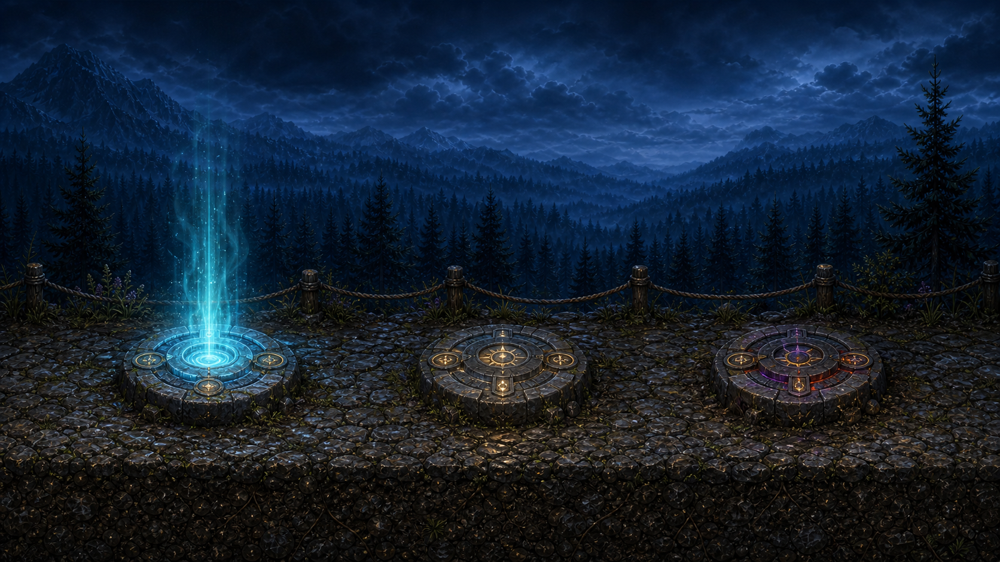
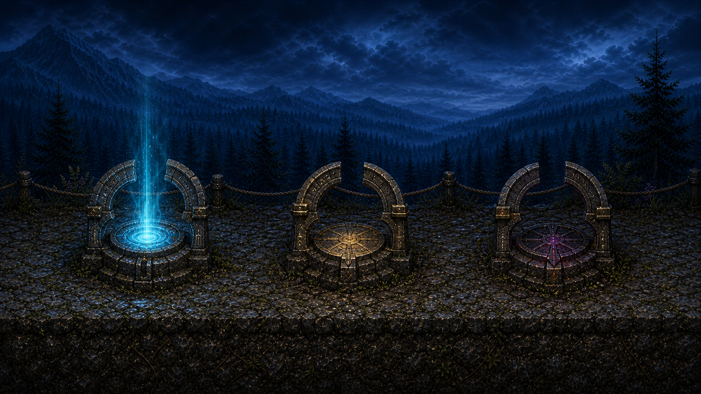
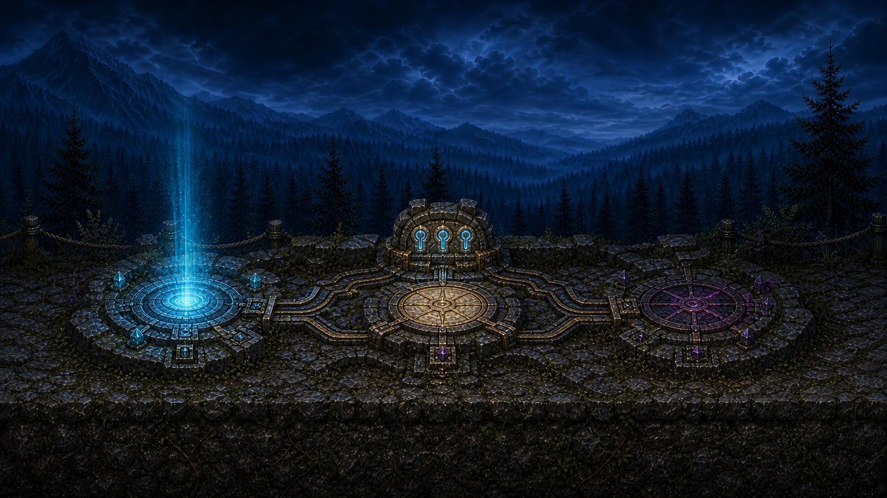

# Heavenblock Surface Gate Concepts v1

**Date:** 2026-07-28  
**Status:** Review only  
**Production changed:** No  
**Runtime wired:** No

These three in-world mockups replace the temporary Phaser `Graphics` circles
used by the Heavenblock surface-access system. They do not change the approved
town, collision, gate coordinates, progression, or teleport behavior.

## Current progression represented

The boards all show the same authoritative state:

1. The player has collected the three required Ancient Relics.
2. The Cloud Reef gate at the left is awakened and usable.
3. The Angel and Devil routes remain sealed until Cloud Reef is completed.
4. Completing Cloud Reef unlocks both the Angel and Devil surface routes.

The three gates remain separate destinations. Island return altars continue to
send the player to the shared surface-return location.

## Option A — Relic Dais

- Lowest silhouette and smallest impact on approved town composition.
- Stone-and-brass plates are physically seated in the cobbles.
- Best fit for normal walking, jumping, and low flight over the route.
- Straightforward production split: opaque base prop, emissive insert, and
  Phaser-controlled activation effects.

## Option B — Aether Well Gates

- Strongest at-a-glance portal readability during fast movement.
- Broken half-rings keep the top open instead of forming a tall doorway.
- Requires more careful collision-free placement because the silhouette is
  taller and visually heavier than the current circles.

## Option C — Shared Sky Altar

- Strongest progression storytelling: three relic sockets power one ancient
  installation, while energy visibly reaches Cloud Reef first.
- Connected channels explain why the three destinations belong together.
- Largest footprint and highest risk of competing with the approved town
  props, so it should be simplified before runtime extraction.

## Recommended direction

Use Option A as the production base, then borrow the three-socket relic signal
from Option C as a compact rear marker. This preserves the approved town and
movement lane while making the relic requirement understandable in-world.

## Review contract

- No image in this folder is loaded, preloaded, registered, or referenced by
  runtime code.
- No baked moon, sun, planet, eclipse disc, HUD, label, or interaction prompt
  is part of the artwork.
- Destination color is semantic: cyan for Cloud Reef, ivory/gold for Angel,
  and violet/crimson for Devil.
- The bright vertical activation light is an FX direction, not a baked final
  sprite requirement.
- Approval should happen before transparent prop extraction, state variants,
  animation frames, preload wiring, or Phaser integration.

The prompt set and reference roles are recorded in
`2026-07-28-imagegen-prompt-manifest.md`.
