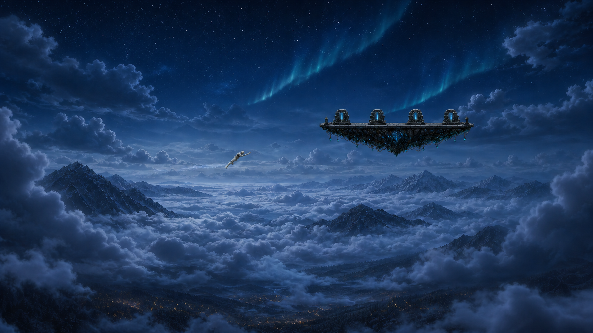
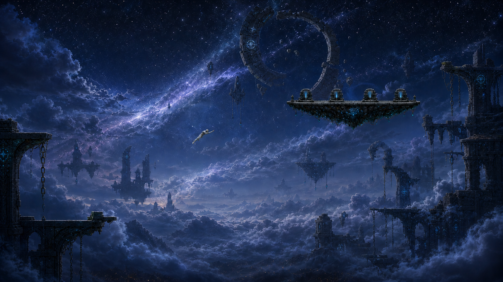
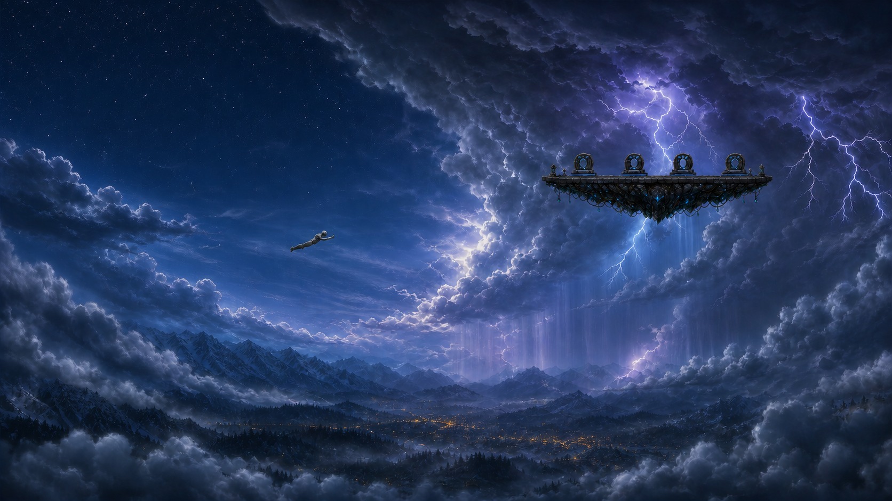

# Flyable Sky Regional Variation Library v2

**Date:** 2026-07-26  
**Status:** Review only  
**Production changed:** No  
**Runtime wired:** No

## Locked scope

- The approved town buildings, town ground, NPC layout, gameplay state,
  collision, and current sky-island platforms remain unchanged.
- This library covers the complete flyable air field above town, not only the
  immediate area around a sky island.
- The existing Level 1 platform silhouette and four eclipse gates are retained
  as the scale and gameplay landmark.
- All three concepts reserve a clear flight corridor and quiet HUD corners.
- The `*-moonless-v2.png` files are the canonical review images. The original
  v1 files remain only as generation provenance.

## Celestial ownership rule

No environment plate may contain a baked sun, moon, planet, eclipse disc, or
large circular celestial light.

`DayNightCycle` already owns the world-space sun/moon orbit and `TIME_CONFIG`
owns their phase visibility. Weather owns atmospheric attenuation. Static sky
art may contain stars, nebula, aurora, clouds, mountains, ruins, rain, and
lightning, but it must leave all moving celestial bodies to runtime.

The approved town composition remains the visual benchmark. Its buildings and
ground do not change; any sky continuation derived from it must be masked or
cropped so a baked moon cannot compete with the authoritative runtime moon.

## Current visual problem

`world/playScene/BackgroundRenderer.js` currently builds the sky from horizontally
repeated `TileSprite` layers. The layers are split into 2,048 px render segments,
but their source art still repeats across the 26,320 px world width. The complete
air field is 280 tiles wide by 65 rows high, or 26,320 × 6,110 world pixels.
The two 16-tile portal platforms occupy only small anchors at x80 and x142 on
row18. Large regions therefore remain visually empty, black, incorrectly
matched, or visibly repeated.

The three directions below are no longer mutually exclusive alternatives. They
are complementary regional packs that can coexist across the full sky.

## Direction A — Moonlit Alpine Cloud Sea

The closest continuation of the approved town: mountain chains, a cloud ocean,
aurora, moonlight, and tiny valley lights establish altitude without changing
the town.

- Best continuity and gameplay readability.
- Primary lower-air and open-flight pack.
- Supplies mountain horizons, cloud oceans, aurora, and quiet navigation space.

## Direction B — Celestial Ruin Belt

Ancient broken rings, suspended monoliths, and a stellar river make the portal
island feel like part of a larger celestial civilization.

- Strongest setting identity and portal lore.
- High-altitude and portal-approach pack around both island banks.
- Uses unique ruin anchors rather than a continuous ruin wallpaper.

## Direction C — Stormbreak Expanse

A readable calm flight lane cuts through a dynamic storm wall with rain curtains,
internal lightning, and dramatic volumetric cloud depth.

- Strongest motion and weather payoff.
- Mobile weather-state pack that can sweep through any horizontal region.
- Storm art overlays the active regional pack instead of replacing the entire sky.

## Full-sky variation layout

The production direction should vary by altitude, horizontal travel, and current
weather at the same time:

| Air band | World rows | Primary content |
|---|---:|---|
| Upper air | `0..25` | Thin atmosphere, stars/aurora, sparse celestial ruins, open navigation space |
| Middle air | `26..47` | Large cloud corridors, cloud ocean, distant mountains, occasional ruin anchors |
| Lower air | `48..64` | Approved-town continuity, forest/mountain horizon, rising mist, first cloud shelf |

Suggested horizontal identities:

1. Western wilderness — natural alpine and cloud variants.
2. Level 1 approach — denser cloud sea with restrained cyan wayfinding.
3. Central divider — quiet aurora/atmosphere transition with no hard seam.
4. Level 2 approach — sparse celestial ruin anchors and deeper indigo atmosphere.
5. Eastern wilderness — alternate mountain/cloud silhouettes and room for a
   moving storm front.

Every boundary should crossfade over several tiles. No adjacent region may use
the same cloud, mountain, or ruin arrangement, and no asset should be mirrored
to manufacture a second variant.

## Recommended production shape after approval

Do not replace the current repeated sky with another single world-width painting.
Build the complete variation library as a camera-streamed parallax system:

1. A lightweight non-repeating atmosphere/gradient pass.
2. Altitude and horizontal-zone selection from a values-layer SSOT.
3. Several unique far mountain or ruin silhouettes per region.
4. Multiple independently moving cloud banks with no mirrored duplicates.
5. Island-local hero scenery streamed only near each portal bank.
6. A movable storm overlay selected by the existing weather state.
7. Separate emissive, rain, aurora, star, and particle passes driven by the
   existing day/night and weather systems.
8. The existing runtime sun and moon rendered above the environment plates,
   with no celestial object baked into the source art.

Unity HDRP or Unreal can supply camera-matched cloud, mountain, ruin, depth,
normal, and emissive render passes. Phaser should consume the exported passes as
small unique world anchors or pooled parallax sprites, not as one repeated
`TileSprite` wallpaper.

## Validation notes

- All three moonless v2 images are 1,672 × 941 PNG review artifacts.
- Each retains one readable flying player, the long cyan-crystal platform, and
  exactly four portal gates.
- No v2 image contains a sun, moon, planet, eclipse disc, or replacement round
  celestial light.
- The local browser build currently stops on the unrelated missing
  `npc-v3-shadow-miner-idle-sheet` preload, so the concepts were grounded in the
  current renderer/config paths and stored runtime/approval captures rather than
  a new live sky screenshot.
- Prompts and reference roles are recorded in
  `2026-07-26-imagegen-prompt-manifest.md`.
