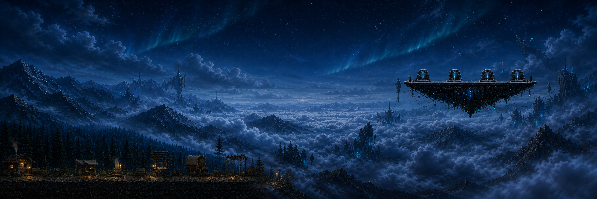
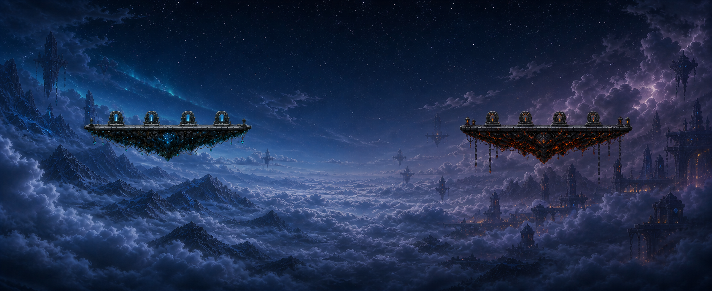
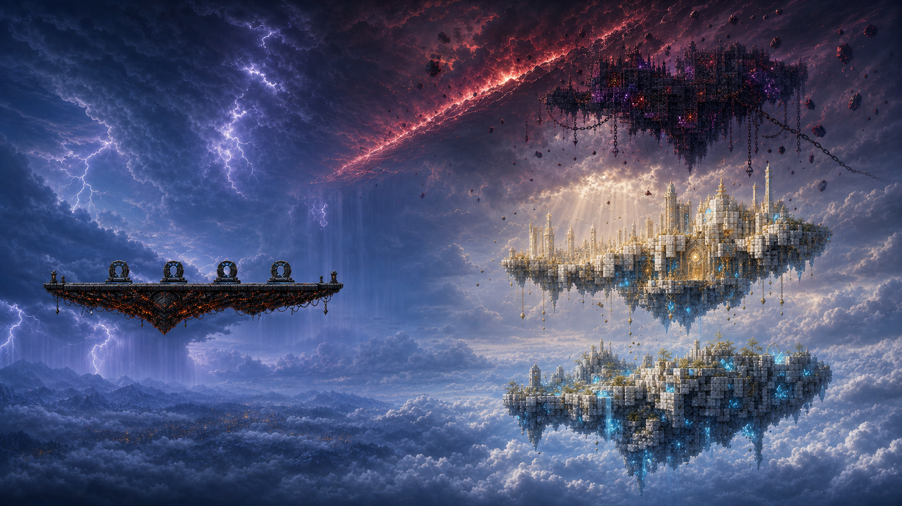

# Whole Upper-World Sky Mockups v1

**Date:** 2026-07-28  
**Status:** Review only  
**Production changed:** No  
**Runtime wired:** No

This set studies the complete connected upper-world composition rather than a
single reusable background. Together, the three traversal boards cover:

1. the approved-town handoff, western airspace, and Level 1 portal island;
2. the quiet central divider and Level 2 portal-island transition;
3. the eastern Level 2 storm corridor and the three-height Heavenblock ascent.

The approved town buildings, ground, gameplay terrain, portal-platform
geometry, portal counts, collision, and progression remain unchanged.

## Generated boards

### Board 1 — West / Town / Level 1

- `2026-07-28-board-01-west-town-level1-traversal-v1.png`
- `2172x724`
- Keeps the approved town as a small, warm lower-world anchor.
- Establishes the western alpine cloud ocean and a broad central flight lane.
- Concentrates cyan crystal, antenna, and cable motifs only near the Level 1
  portal island.

### Board 2 — Divider / Level 2 transition

- `2026-07-28-board-02-divider-level2-transition-v1.png`
- `1960x802`
- Shows both portal islands at matching gameplay scale with four gates each.
- Uses an intentionally quiet center saddle rather than a hard regional seam.
- Introduces Level 2 through indigo cloud, iron architecture, chains, and
  restrained ember light instead of a full-screen red grade.

### Board 3 — Eastern Level 2 / Heavenblock ascent

- `2026-07-28-board-03-level2-heavenblock-ascent-v1.png`
- `1672x941`
- Connects the Level 2 island and storm corridor to Cloud Reef, Angel, and
  Devil masses at three clearly separated altitudes.
- Replaces the former baked eclipse body with an asymmetrical diagonal crimson
  atmospheric scar.
- Uses shared clouds, debris, chains, and light shafts to blend the three
  Heavenblock identities without rectangular card edges.

## Celestial rule

No mockup may contain a baked sun, moon, planet, eclipse disc, or distant
complete circular halo. Complete rings are reserved for the four portal gates
physically attached to each portal platform. The runtime `DayNightCycle`
remains the only owner of moving sun and moon bodies.

## Review contract

- Environment-only: no player, HUD, text, labels, logos, or watermarks.
- Painterly side-view presentation matched to the approved town benchmark.
- Readable open flight lanes remain between landmarks.
- Adjacent regions use different silhouettes; no mirrored background copies.
- Large ruins remain unmistakably distant and cannot resemble playable ground.
- Existing Heavenblock identities may be re-contextualized, but their baked
  celestial discs are not retained.

These are composition approvals, not production-ready background plates.
Runtime extraction would split atmosphere, horizon, clouds, hero structures,
props, emissive elements, and weather into separately streamed layers.

The source prompts and reference roles are recorded in
`2026-07-28-imagegen-prompt-manifest.md`.
