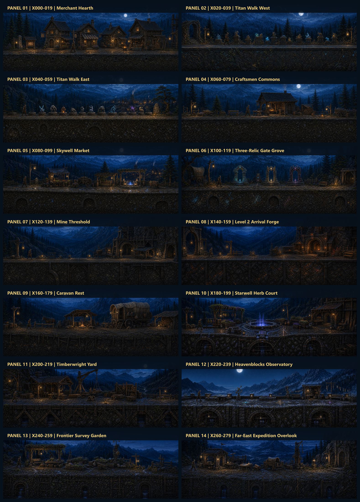

# Complete Surface Landscape Library V1

**Date:** 2026-07-28  
**Status:** `reviewOnly: true`  
**Production changed:** No  
**Runtime wired:** No

This library defines the proposed final visual target for every part of the
280-tile Level 1 and Level 2 surface. Fourteen contiguous twenty-tile gameplay
views preserve real landmark positions, the flat traversable baseline, the
1.75 m player scale, enterable door proportions, and modular runtime layering.

## Overview sheets

- [Level 1 — panels 01-07](2026-07-28-overview-level1-segments-01-07-v1.png)
- [Level 2 — panels 08-14](2026-07-28-overview-level2-segments-08-14-v1.png)
- [Normalized ImageGen prompt manifest](2026-07-28-imagegen-prompt-manifest.md)
- [Selected-file hash and dimension manifest](2026-07-28-library-manifest-v1.json)
- [Placement and modular extraction proposal](../../markdown/2026-07-28-complete-surface-landscape-mockup-library.md)

## Coverage

| Panel | Tile range | Final landscape identity |
|---|---:|---|
| 01 | 000-019 | Merchant Hearth |
| 02 | 020-039 | Titan Walk West |
| 03 | 040-059 | Titan Walk East and Honor Garden |
| 04 | 060-079 | Craftsmen Commons |
| 05 | 080-099 | Skywell Market |
| 06 | 100-119 | Three-Relic Gate Grove |
| 07 | 120-139 | Mine Threshold and Drop Seam |
| 08 | 140-159 | Level 2 Arrival Forge |
| 09 | 160-179 | Caravan Rest |
| 10 | 180-199 | Starwell Herb Court |
| 11 | 200-219 | Timberwright Yard |
| 12 | 220-239 | Heavenblocks Observatory |
| 13 | 240-259 | Frontier Survey Garden |
| 14 | 260-279 | Far-East Expedition Overlook |

## Shared visual contract

- Premium moonlit mountain-forest presentation matching the approved benchmark.
- Exact side-on gameplay composition with no perspective road.
- Continuous level walk line and a unique authored ground/foundation treatment
  in every panel.
- One 1.75 m scale character for proportion review only; the player is never a
  baked runtime-landscape requirement.
- Doors and usable openings remain physically enterable.
- Props use irregular story-driven clusters, varied size, varied distance, and
  deliberate breathing room.
- Major gameplay landmarks and interaction corridors remain fully readable.
- Every composition is intended to split into far, rear, mid, prop, foreground,
  ground-top, retaining-facade, emissive, and motion layers.

## Production boundary

No mockup in this folder is preloaded, registered, or referenced by the game.
Approval comes before transparent extraction, state variants, animation,
streaming configuration, or Phaser wiring.

## Retained comparison

Panel 03 v2 is the library selection because it uses the real low-plinth Titan
Walk language and leaves every miniature unobscured. Its v1 rune-monolith pass
is retained beside it as rejected comparison evidence and is excluded from the
manifest and overview sheets.
