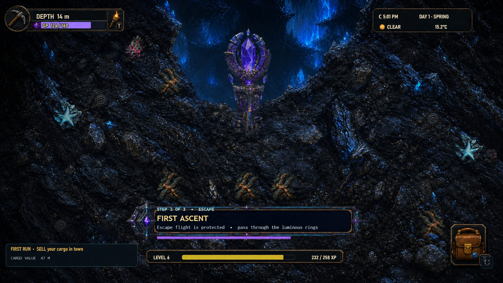
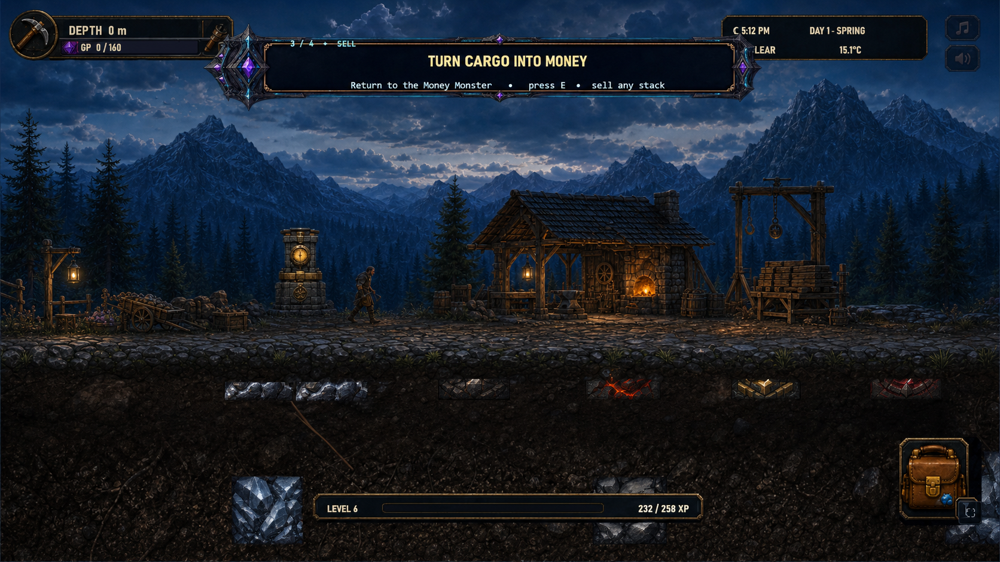
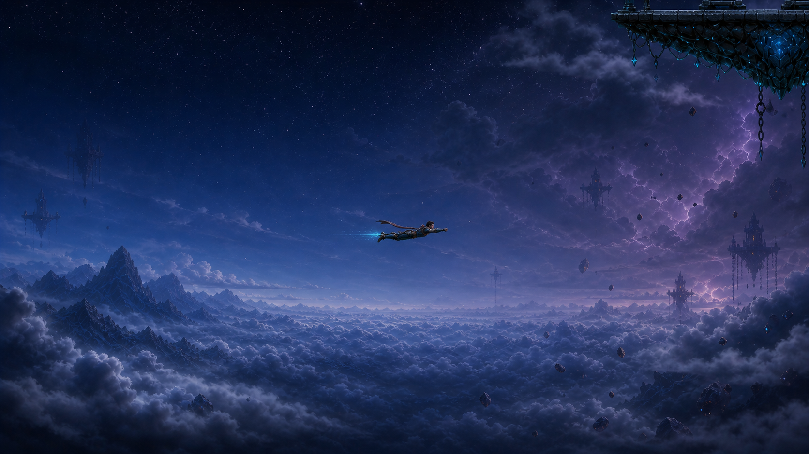

# Whole-World Visual Gap Mockups V1

**Date:** 2026-07-28  
**Status:** `reviewOnly: true`  
**Production changed:** No  
**Runtime wired:** No

This package targets the largest remaining visual gaps after the current
scenic-v2 expansion. It does not propose more full-screen underground
backgrounds: the runtime already has 120 underground backdrop cards, 10 motion
loops, 50 masked terrain structures, 25 Titan chambers, opaque resource and
reward art, and the Level 2 modular surface-prop pass.

## Mockups

### 1. Underground foreground cohesion

- Replaces the dominant mirrored/kaleidoscopic mine material with irregular
  geology while keeping the live gameplay camera and HUD.
- Keeps the scenic backdrop visible only through open cave space.
- Demonstrates varied exposed edges and terrain-masked structures without
  changing cave topology, collision, resources, or markers.

### 2. Surface chapter runtime framing

- Shows how a unique surface chapter can sit inside the current gameplay
  camera instead of remaining a full-screen concept painting.
- Preserves a clear walk lane, the live HUD, the underground cutaway, and
  player scale.
- Uses a celestial-free sky so `DayNightCycle` remains the only sun/moon
  authority.

### 3. Flight-corridor parallax

- Fills the under-dressed vertical space between the surface and fixed
  portal-island altitude.
- Uses three separable image layers: far cloud ocean, distant suspended ruins,
  and sparse near wisps/debris.
- Keeps a broad readable flight lane and shows only the edge of an existing
  portal island as a destination cue.

## Priority interpretation

1. Finish the underground terrain-variation, exposed-edge, and transition
   treatment before generating more cavern backdrops.
2. Convert the approved 14-panel surface library into modular streamed layers
   rather than loading the paintings as monolithic gameplay cards.
3. Build the upper-world corridor from separately streamed, celestial-free
   parallax plates.
4. Add authored biome-boundary seam kits and restrained near-field ambient
   image strips only after the first three are stable.

The normalized built-in ImageGen prompts and input roles are recorded in
`2026-07-28-imagegen-prompt-manifest.md`.
